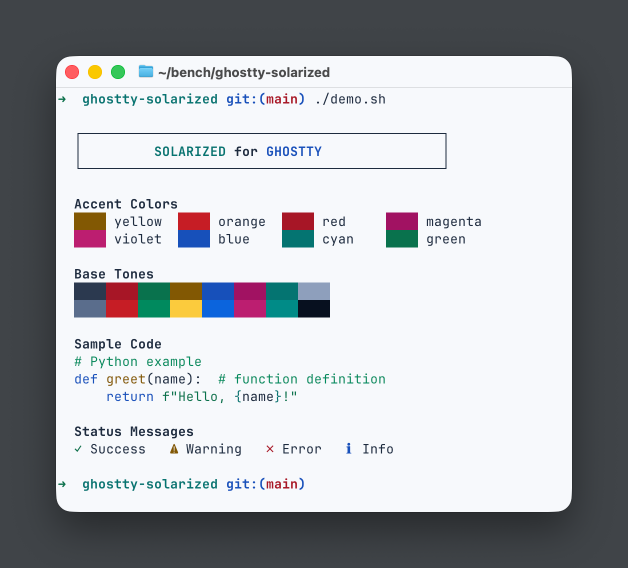
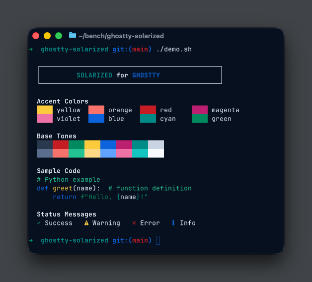

# Elastic UI Theme for Ghostty

Color themes for Ghostty terminal emulator, based on the [Elastic UI Framework](https://eui.elastic.co) color palette.

## Screenshots

### EUI Dark



### EUI Light



## Installation

### Option 1: Copy to themes directory

```bash
# Create themes directory if it doesn't exist
mkdir -p ~/.config/ghostty/themes

# Copy theme files
cp themes/eui-dark themes/eui-light ~/.config/ghostty/themes/
```

Then add to your Ghostty config (`~/.config/ghostty/config`):

```
theme = eui-dark
```

Or for automatic light/dark mode switching:

```
theme = dark:eui-dark,light:eui-light
```

### Option 2: Use absolute path

Reference the theme file directly:

```
theme = /path/to/ghostty-eui/themes/eui-dark
```

## Demo

Run the demo script to preview the color palette:

```bash
./demo.sh
```

## Repository Structure

```
ghostty-eui/
├── themes/
│   ├── eui-dark           # Dark background theme
│   └── eui-light          # Light background theme
├── screenshots/
│   ├── eui-dark.png
│   └── eui-light.png
├── demo.sh                # Color palette demo script
└── README.md
```

## Color Palette

| ANSI Color | EUI Token | Hex (Dark) | Purpose |
|------------|-----------|------------|---------|
| Black (0) | darkestShade | `#2B394F` | Subdued backgrounds |
| Red (1) | danger | `#C61E25` | Errors, destructive actions |
| Green (2) | success | `#008A5E` | Positive messages, additions |
| Yellow (3) | warning | `#FACB3D` | Warnings, caution |
| Blue (4) | primary | `#0B64DD` | Main brand, links, CTAs |
| Magenta (5) | accent | `#BC1E70` | Notifications, selections |
| Cyan (6) | accentSecondary | `#008B87` | Secondary highlights |
| White (7) | lightShade | `#CAD3E2` | Light text, borders |

Bright colors (8-15) use lighter variants from EUI's visualization and severity palettes.

### Theme Backgrounds

| Theme | Background | Foreground |
|-------|------------|------------|
| EUI Dark | `#07101F` (fullShade) | `#E3E8F2` (lightText) |
| EUI Light | `#F6F9FC` (body) | `#1D2A3E` (textParagraph) |

## Credits

- [Elastic UI Framework](https://eui.elastic.co)
- [Ghostty terminal emulator](https://ghostty.org)

## License

These themes are based on the Elastic UI color palette. Elastic UI is licensed under the [Elastic License 2.0](https://www.elastic.co/licensing/elastic-license).
